###  Contents

* [Introduction](#intro-sectionn)
* [Screenshots](#screenshots-section)
    * [Front end](#screenshots-section-front-end)
    * [Administrator](#screenshots-section-admin)
  
* [Code](#code-section)

* [Install](#install-section)
<a name='intro-section'></a>
## Match Tools Front End 

This is a demo project I have done mainly with Vue Js 3 and Bootstrap 5.
This works as am API client to my project 
[Laravel10 Match Tools API](https://github.com/demotuulia/Laravel10_MatchToolsModule#readme).\
 The backend API application can be used to search matches between companies and clients.
In my example in this front end application  I  use companies with vacancies and professionals 
with profiles.
With this tool both of the parties can find matches for their profiles.
As well this application could be used for example for rental apartments or boats.\
\
The core of this project are the dynamic match forms, which the administrator can manage. 
The match forms
are filled by both parties and the search of matches is based on these forms.
Below we have a match form having 6 matches (the same form is rendered for both companies 
and professionals).

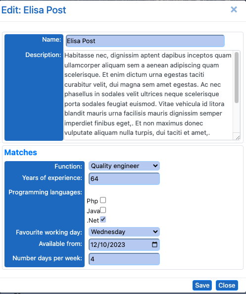

The administrator can manage these forms by editing,  adding and deleting the matches 
in the form.\
There are match types, which the administrator can choose. In the image below we have the following
match types.
  * MENU: for a match the  same option must be selected
  * BIGGER_THAN: The professional must have a bigger value than the value of the
     company. Example: The 'years of experience' of the professional must be bigger than
    the vacancy requires.
  * MULTIPLE_CHOOSE: For a match, the same options must be selected.
  * DATE_FROM: Example: The professional must be available from the give date.
  * EQUALS: The numeric value must match.
  
\
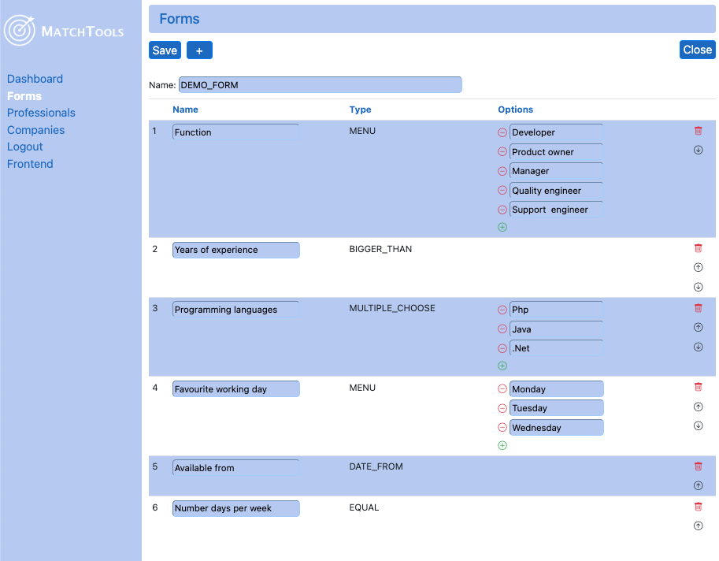

Once a profile form is filled the professional or a company can find matches
for his/her profile.The matches are based on the score. The highest scores are on top of the list.\
\
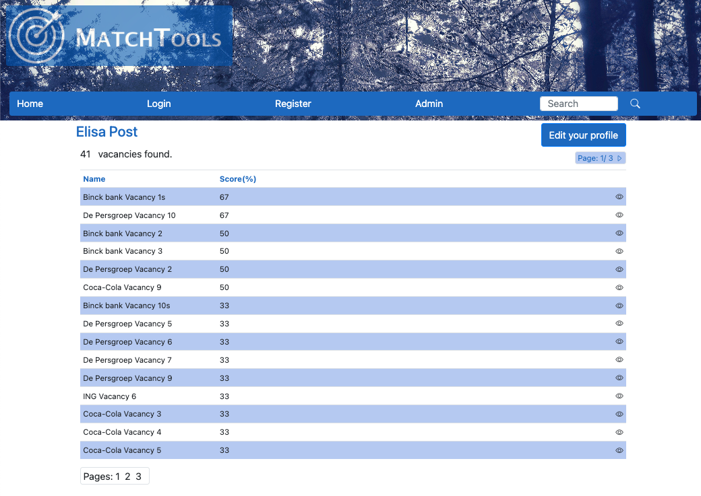

<a name='screenshots-section'></a>
# Screenshots
<a name='screenshots-section-front-end'></a>
## Front end

Below there are some screenshots.

### Landing page
This is the home page introducing the site.
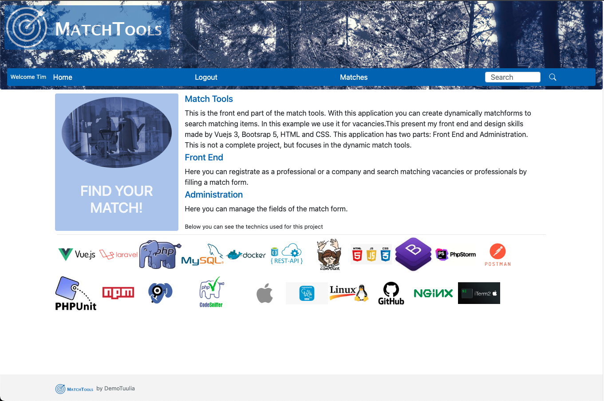
Responsive\
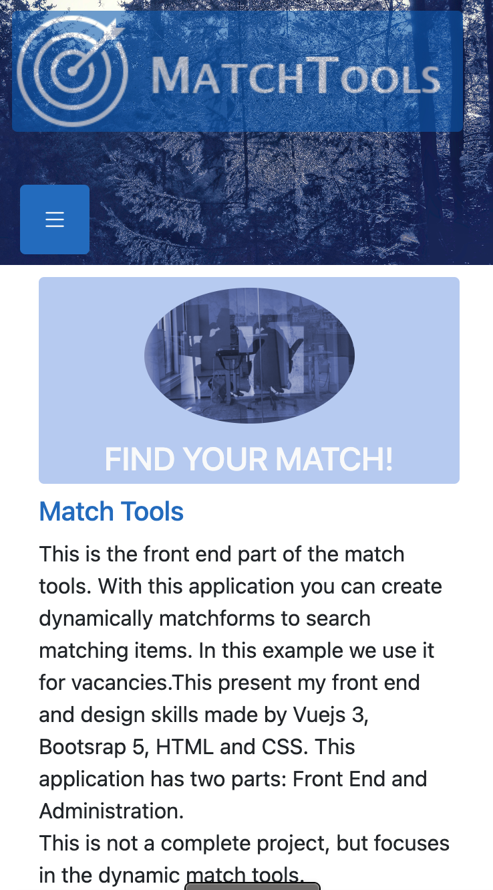

### Registration

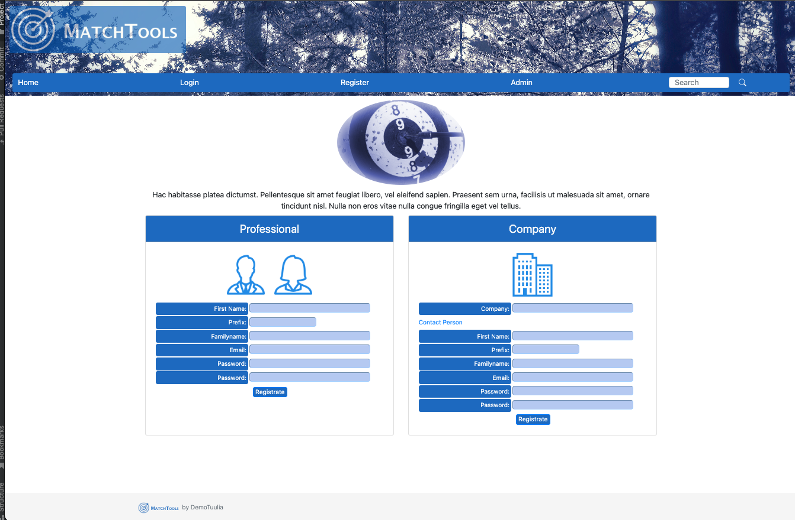\
\
\
Responsive\
\
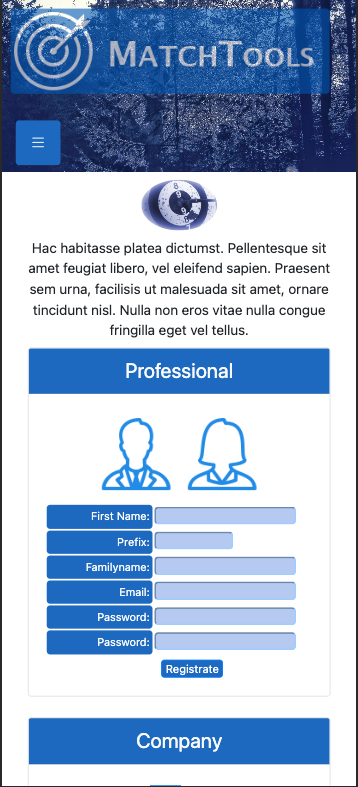

### Login

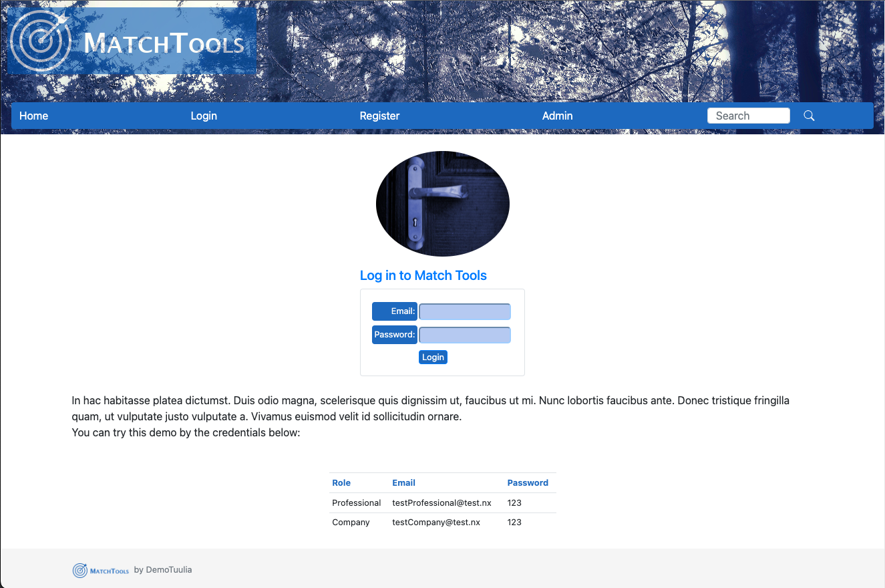\
\
Responsive\
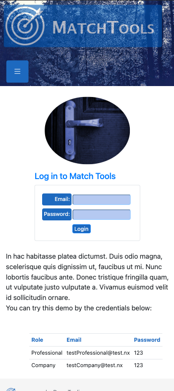


### Professional matches page
List
\
\
Responsive list\
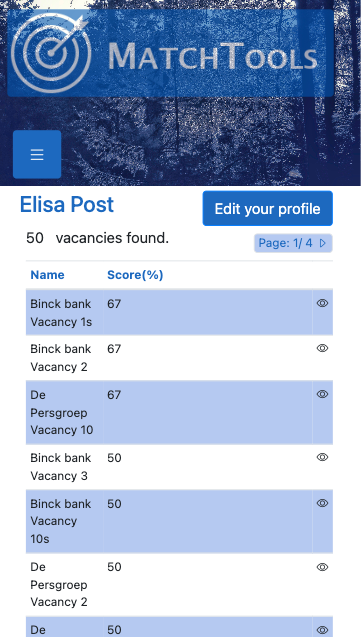\
\
\
Form\
\
\
Responsive form\
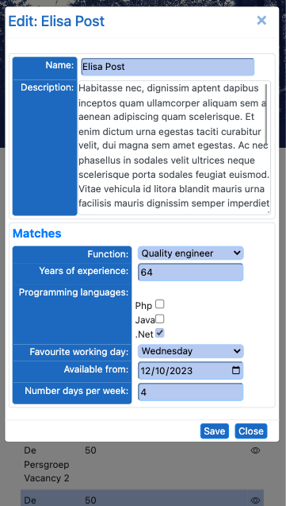

Vacancy details\
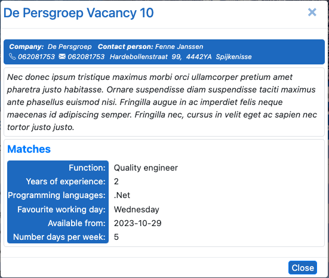\
\
Responsive vacancy details\
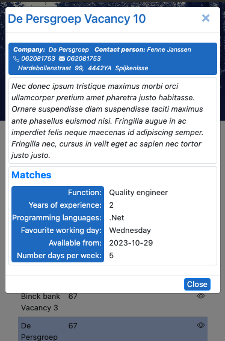

<a name='screenshots-section-admin'></a>
## Administrator
### Admin login

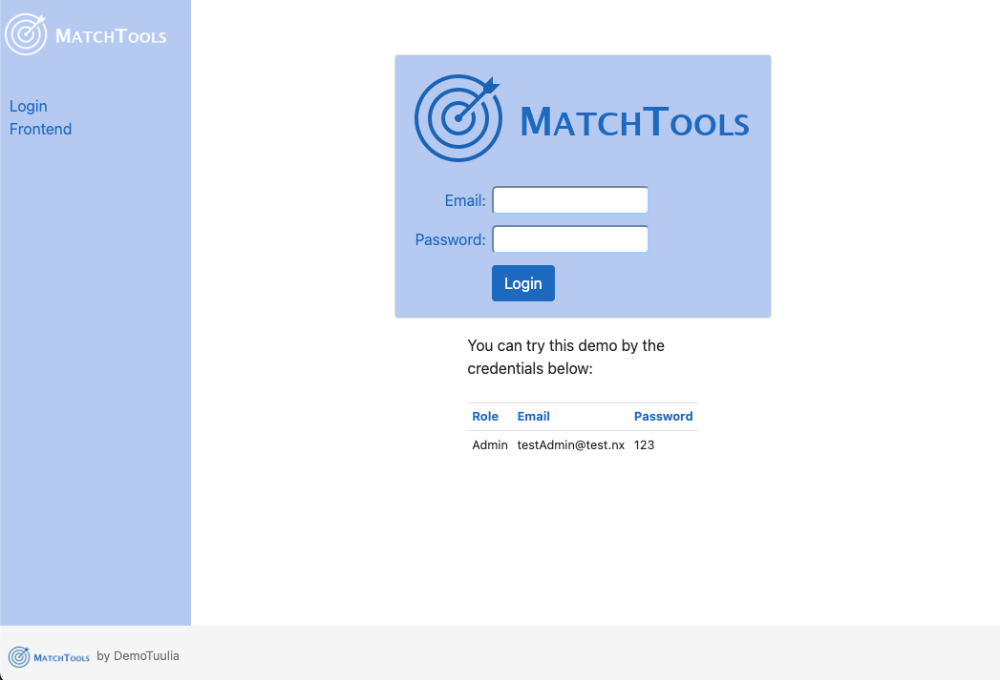

### Admin dashboard
Here you can see the statistics of the matches
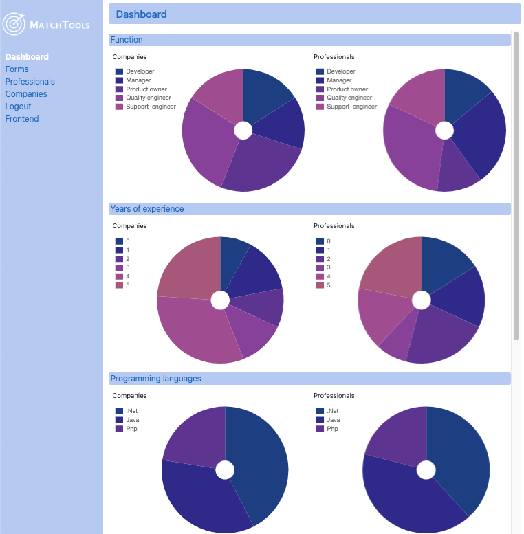


### Admin match form
Here you can add, delete and edit the matches.
The possible match types are\


<a name='code-section'></a>
# Code

This code is made as much as possible with Vue Js 3 and Boostrap 5 standards. It uses the Vue Js router.
This repository has both the front-end and admin. For this purpose
I must make two different Apps. This my own solution in main.js

```

let uri = window.location.pathname;

if(uri.startsWith('/admin')) {
    // Admin App
    const app = createApp(AdminApp);
    app.use(router);
    app.use(VueCookies);
    app.use(Vue3ConfirmDialog);
    app.mount("#app");
}
else {
    // Front End App
    const app = createApp(App);
    app.use(router);
    app.use(VueCookies);
    app.use(Vue3ConfirmDialog);
    app.mount("#app");
}
```


## Terminology
. <b>form</b> Form which includes matches to be filled. This application has one form\
but this could be extended to multiple forms, forexample a form per profession group.\
. <b>match</b> One field in matches form\
. <b>profile</b> A profile of a porfessioal or a vacancy of a company
c

<a name='install-section'></a>
## Install

1) First you need to install the backend API. See
   [Install API](https://github.com/demotuulia/Laravel10_MatchToolsModule#install-section)

3) Install npm
 https://docs.npmjs.com/downloading-and-installing-node-js-and-npm

4) Clone this procjet by


   ``` git clone https://github.com/demotuulia/VueJs_MatchToolsModuleClient.git```


5) Go to the cloned folder and do
```
npm install
```
5) Configure
copy .env.example to .env and configure. Normally you don't need to change anything

```
cp env.example  .env 
```
6) start server
```
npm run dev
```
or
```
./scripts/startServer.sh
```

You see the url below to open the apllication on your browser
```

  VITE v4.4.9  ready in 502 ms

  ➜  Local:   http://localhost:5173/
  ➜  Network: use --host to expose
  ➜  press h to show help


```
You open the admin module
by:
```
http://localhost:5173/admin
```
